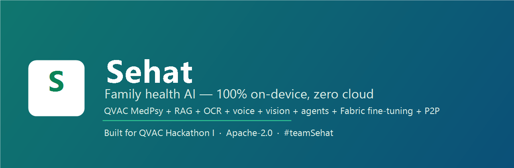
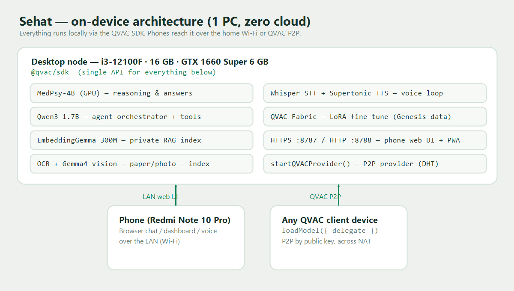

# Sehat 🏠🩺



**Offline-first family health assistant — 100% on-device AI via the [QVAC SDK](https://qvac.tether.io).**

📊 One-glance metrics: [`docs/BENCHMARKS.md`](docs/BENCHMARKS.md) · Architecture below.



Built for **QVAC Hackathon I – Unleash Edge AI** (June 2026).
Track: **General Purpose** (BYOH desktop) · creative **Psy-model** use (MedPsy-4B) · Build in Public: `#teamSehat`
Repo: https://github.com/PugarHuda/sehat

> **Powered by QVAC MedPsy-4B** — Tether's own edge medical model. We independently
> reproduced its efficiency on a GTX 1660 Super: **~16× faster TTFT and +34% throughput
> vs Google's MedGemma-4B** on the same prompt and GPU (see
> [`artifacts/medpsy-vs-medgemma.md`](artifacts/medpsy-vs-medgemma.md)). Run
> `SEHAT_MODEL=medgemma npm start` to A/B it yourself.

> ⚠️ Sehat is an educational / personal-organization tool. It is **not** a medical device
> and does not provide diagnosis or treatment. Always consult a healthcare professional.

## What it does

Sehat turns one regular family PC into a private health hub. Everything runs locally;
no data ever leaves the home network.

1. **Ingest** — lab results, prescriptions, and doctor notes become a private, on-disk
   vector index. Paper enters by photo: local OCR reads it (0.94 avg confidence) straight
   into the index. You can also paste a record or **import a CSV** (`date,metric,value`).
2. **Ask, in any language** — by text or voice. **MedPsy** reasons over the retrieved
   records and answers with `[doc: ...]` citations, including cross-document trends
   ("compare Dad's June labs against March"). Language is **auto-detected** — ask in
   Indonesian, get an Indonesian answer; English in, English out.
3. **Auto-capture from chat** — say "my fasting glucose today is 95, BP 118/76" and Sehat
   extracts and saves a dated record (a 📌 Saved chip confirms). A pre-filter + extraction
   pass tell *reporting* from *asking*, so plain questions are never saved.
4. **Family dashboard** — per-member cards with trend sparklines; tap one for a detail
   drawer (each vital with reference range, status, change vs previous, % since first,
   min–max), medications, and allergies. Mark a member as **"You"** (profile name).
5. **Proactive alerts** — Sehat scans the records and flags rising/abnormal vitals, then
   MedPsy writes a calm plain-language briefing you can **🔊 listen to** (QVAC TTS).
6. **Reminders & Emergency QR** — upcoming re-tests / follow-ups / vaccine dates parsed
   from documents; an **offline Emergency QR** per member (allergies, conditions, meds,
   recent vitals — scannable, no cloud); one-click **Markdown export**.
7. **Orchestrate (agent mode)** — a Qwen3-1.7B orchestrator with QVAC tool calling plans
   the work: `search_records` (RAG), `calculate_change` (deterministic math, no LLM
   arithmetic), and `consult` (hands medical interpretation to the MedPsy specialist).
8. **Reach every device** —
   - **LAN web UI / PWA**: open the link below on any phone; invite the whole family with 🔗.
   - **Hands-free voice (any language)**: tap 🎙️, speak, and the answer is spoken back
     (multilingual Whisper STT → MedPsy → Supertonic TTS) — a full local voice loop in
     the browser. Whisper auto-detects the spoken language (Indonesian, English, …).
   - **QVAC P2P delegated inference**: a client device loads *no model* and runs completions
     on the home PC via Holepunch DHT, addressed by public key — no server, no port
     forwarding, works across NATs. Start with `SEHAT_P2P=1 npm start`; a relative on **any
     network** connects via `npm run delegate <publicKey>` (key shown in the Invite panel).
9. **Resist attacks** — documents are untrusted data. `npm run test:injection` ingests a
   poisoned note (role-play hijack + canary exfiltration + phishing); Sehat answers the
   real fact, refuses the injection, and warns the document looks tampered with. PASS.

## Open it (100% local — no internet, same Wi-Fi as the PC)

```
Phone, easy (chat/dashboard/alerts/QR):   http://<desktop-ip>:8788
Phone, full (adds mic + voice, HTTPS):    https://<desktop-ip>:8787   (accept the cert once)
On the PC:                                http://localhost:8788
```

The mic/voice loop needs HTTPS (browsers only allow microphone access in a secure
context); everything else works over plain HTTP. After models are cached you can pull the
internet entirely — Sehat keeps working on the LAN.

**Desktop app (native window):** `npm run desktop` launches Sehat as an Electron
app — it boots the local server, loads the on-device models, and opens the UI in a
native window (mic permission auto-granted, no cert prompt). Same 100%-local engine,
zero cloud.

**Package it as a distributable app:** `npm run package` runs the official
`@qvac/sdk/electron-forge` plugin, which bundles the QVAC worker + native addons
(pruning the model backends we don't use, per `qvac.config.json`) so models run
inside the package. On a host where Forge's zip extractor stalls, assemble the
portable build directly with `powershell -ExecutionPolicy Bypass -File
scripts/make-portable.ps1` → `out/Sehat-win32-x64/Sehat.exe` (+ a zip). The packaged
app was verified end-to-end: native window, in-package QVAC worker, live MedPsy
streaming over RAG — all offline.

## Measured performance (GTX 1660 Super, all local)

| Workload | Result |
|---|---|
| **QVAC MedPsy-4B Q4_K_M, GPU** | **TTFT 343 ms · 59.7 tok/s** (vs MedGemma-4B: TTFT 5,626 ms · 44.4 tok/s, same prompt/GPU) |
| Llama 3.2 1B Q4, GPU (`gpu_layers: 99`) | 127.6 tok/s · TTFT 116 ms (CPU baseline 31.6 tok/s) |
| RAG vector search (GTE-large FP16) | `ragReindex` (IVF) cuts 200-doc search 125 ms → 11 ms |
| OCR sweep (13 photographed docs) | **13/13 pass** · print, handwriting, rotated, small-font & Indonesian (conf 0.66–0.97) |
| STT (Whisper large-v3-turbo) | multilingual, auto-detects language; transcribes on-device |
| Multi-agent run (tool calls incl. MedPsy consult) | completes within the 8 k ctx window |
| Reliability on 6 GB VRAM | a VRAM guard keeps one optional model (STT/OCR/TTS/agent) resident at a time → voice→agent→OCR run without OOM |
| Vision: photo → structured analysis (no OCR) | all values read correctly; 43.7 tok/s (SDK stats) |
| **LoRA fine-tune (QVAC Fabric), Qwen3-600M** | hand-written set: loss 3.00→1.77 in 238 s; **real QVAC Genesis-I medical data: loss 4.39→1.51, val acc 68.8%** |
| ID↔EN translation (Bergamot, CPU) | sub-second per message |
| P2P delegated completion (no local model) | TTFT 0.9–1.3 s; 4.8 tok/s streamed / ~7.7 batched (transport-bound, documented honestly) |

Numbers come from the committed [`artifacts/audit-log.jsonl`](artifacts/audit-log.jsonl)
(prompt, tokens, TTFT, tok/s per call) and [`artifacts/qa-report.md`](artifacts/qa-report.md)
(22/22 server cases + 13/13 OCR). SDK-native telemetry: [`artifacts/profiler-export.json`](artifacts/profiler-export.json).

## Models used (all via @qvac/sdk, all on-device)

| Role | Model |
|---|---|
| Medical reasoning (primary brain) | **QVAC MedPsy-4B Q4_K_M** (Tether's Psy model, from HF) |
| Medical reasoning (A/B benchmark) | `MEDGEMMA_4B_IT_Q4_1` (Google, comparison only) |
| Orchestrator agent (tool calling) | `QWEN3_1_7B_INST_Q4` |
| Embeddings / RAG | `GTE_LARGE_FP16` (higher-accuracy retrieval) |
| Speech-to-text (multilingual, auto-detect) | `WHISPER_LARGE_V3_TURBO` |
| Text-to-speech | `TTS_EN_SUPERTONIC_Q8_0` |
| OCR | `OCR_LATIN_RECOGNIZER_1` |
| Translation ID↔EN | `BERGAMOT_ID_EN` + `BERGAMOT_EN_ID` |
| Vision (photo understanding) | `GEMMA4_4B_MULTIMODAL_Q4_K_M` + `MMPROJ_GEMMA4_4B_MULTIMODAL_F16` |
| Fine-tune base (QVAC Fabric LoRA) | `QWEN3_600M_INST_Q4` + hand-written set and **real `qvac/GenesisI` medical data** |

## Architecture

```
┌──────────────────────────────────────────────────────────┐
│  Desktop node — i3-12100F · 16 GB · GTX 1660 Super 6 GB   │
│                                                          │
│   @qvac/sdk (single API for everything below)            │
│   ├─ MedPsy-4B (GPU)          — reasoning & answers       │
│   ├─ Qwen3-1.7B (GPU)         — agent orchestrator+tools  │
│   ├─ GTE-large (FP16)         — private RAG workspace     │
│   ├─ OCR · Gemma4 vision      — paper/photo → index       │
│   ├─ Whisper STT + Supertonic TTS — voice loop            │
│   ├─ HTTPS :8787 / HTTP :8788 — phone web UI + PWA (SSE)  │
│   └─ startQVACProvider()      — P2P provider (DHT)        │
└───────────▲──────────────────────────────▲───────────────┘
            │ LAN (web UI, streaming)       │ QVAC P2P delegation
┌───────────┴───────────────┐  ┌───────────┴───────────────┐
│ Phone (Redmi Note 10 Pro) │  │ Any QVAC client device     │
│ browser chat / dashboard  │  │ loadModel({ delegate })    │
└───────────────────────────┘  └───────────────────────────┘
```

## Hardware (declared for verification)

| Device | Specs |
|---|---|
| Desktop (main, General Purpose track) | Intel Core i3-12100F (4C/8T) · 16 GB DDR4 · NVIDIA GTX 1660 Super 6 GB · 500 GB NVMe SSD · Windows 11 |
| Phone (web-UI client) | Xiaomi Redmi Note 10 Pro (M2101K6G) · Snapdragon 732G · 8 GB RAM · 128 GB · Android 13 |

Evidence: [`artifacts/hardware/`](artifacts/hardware/) — `msinfo32-report.txt`, `dxdiag-report.txt`,
`nvidia-smi.txt`, CPU/GPU/OS, and a Task Manager screenshot.

## Reproducibility

Requirements: Node.js ≥ 22, ~6 GB free disk for models, NVIDIA GPU recommended.

```bash
git clone https://github.com/PugarHuda/sehat && cd sehat
npm install                      # flaky network? add --fetch-retries 5

npm run smoke                    # load a model, one completion + audit log
npm run test:gpu                 # same, GPU-offloaded (expect ~4x speedup)
npm run demo:rag                 # ingest sample docs, cited cross-doc Q&A
npm run demo:ocr                 # photo of lab report -> OCR -> RAG -> answer
npm run demo:voice               # TTS question -> STT -> RAG answer -> TTS wav
npm run demo:agent               # multi-agent: Qwen orchestrator + tools + MedPsy
npm run demo:vision              # photo -> local VLM analysis
npm run demo:translate           # Bahasa Indonesia round-trip via Bergamot
npm run test:injection           # prompt-injection resistance (expects PASS)
npm run genesis:prepare          # fetch a sample of QVAC Genesis-I medical data
npm run demo:finetune:genesis    # LoRA fine-tune on real Genesis data (Fabric)
npm run demo:finetune            # LoRA fine-tune on the hand-written "Sehat style" set
npm run profile                  # evidence run with the SDK's own profiler
node src/qa-suite.js             # 22 end-to-end server tests (server must be up)
node src/qa-ocr.js               # 13-image OCR sweep (print/handwriting/rotated/Indonesian)

npm start                        # the app: phone UI on https://<ip>:8787 + http://<ip>:8788
npm run desktop                  # native desktop app (Electron) — same engine, a window
SEHAT_P2P=1 npm start            # also start the P2P "remote family node"
npm run delegate <publicKey>     # from another device: delegated inference, no local model
```

Optional family PIN: `SEHAT_PIN=2468 npm start` requires that PIN on every API
call (the app prompts once and remembers it on-device). Default is open — fine on
a trusted home Wi-Fi, recommended ON if others share the network.

HTTPS: `npm start` serves TLS if `certs/sehat.pfx` exists (needed for the phone mic).
Generate one with PowerShell `New-SelfSignedCertificate` + `Export-PfxCertificate`
(passphrase `sehat-lan`), or delete `certs/` to run plain HTTP (mic disabled, chat works).

First run of each demo downloads its models once (QVAC registry or HuggingFace), then runs
fully offline. All demo documents are **synthetic** — no real medical data in this repo.

### Blind relays (NAT traversal)

QVAC supports blind relays — Hyperswarm relays that bridge P2P across NATs/firewalls — via a
`QVAC_CONFIG_PATH` config listing `swarmRelays` keys. Sehat's P2P delegation works with this
unchanged. We did not stand up our own relay infra, so we document the capability rather than
fake a demo; on a home LAN / direct DHT (our setup) relays aren't needed.

## Artifacts (hackathon evidence bundle)

- [`remote-apis.yaml`](remote-apis.yaml) — every remote call disclosed (no cloud AI)
- [`NOTICE-genesis.md`](NOTICE-genesis.md) — QVAC Genesis dataset license (CC-BY-NC) disclosure
- [`artifacts/audit-log.jsonl`](artifacts/audit-log.jsonl) — model loads + per-call prompt/tokens/TTFT/tok-s
- [`artifacts/qa-report.md`](artifacts/qa-report.md) — 22/22 server cases + 13/13 OCR sweep
- [`artifacts/medpsy-vs-medgemma.md`](artifacts/medpsy-vs-medgemma.md) — MedPsy vs MedGemma benchmark
- [`artifacts/qvac-stack-coverage.md`](artifacts/qvac-stack-coverage.md) — which QVAC stack legs we use
- [`artifacts/hardware/`](artifacts/hardware/) — system profiler reports + screenshot
- [`artifacts/profiler-export.json`](artifacts/profiler-export.json) — SDK-native profiler export
- [`docs/DEMO-VIDEO-SCRIPT.md`](docs/DEMO-VIDEO-SCRIPT.md) — 5-minute demo storyboard
- Demo video: _YouTube unlisted link in the submission form_

## License

[Apache 2.0](LICENSE) — code. The Genesis-derived demo adapter is CC-BY-NC (see NOTICE-genesis.md).
